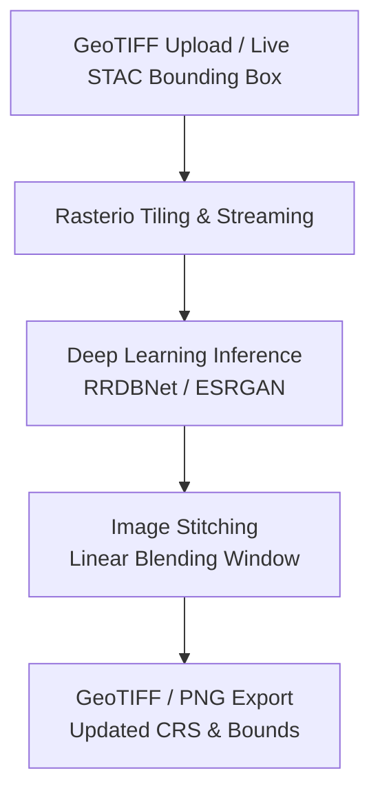

# Deep Learning Based Super Resolution Mapping (SRM) from Medium Resolution Satellite Imageries

**Problem Statement ID:** 26142

This repository contains a full-stack solution for upscaling medium-resolution satellite imagery (like Sentinel-2) into high-resolution maps using Deep Learning Super Resolution (RRDBNet / ESRGAN).

## Architecture



## Production Deployment Architecture

The system is separated into a two-part serverless deployment:
- **Backend:** `backend/` directory deployed to [Modal](https://modal.com/) (Serverless GPU).
- **Frontend:** `frontend/` directory deployed to [Vercel](https://vercel.com) (Static Hosting).

### 1. Deploying the Backend (Modal)

The backend utilizes Modal for zero-configuration, auto-scaling GPU inference.

1. Navigate to the backend directory:
```bash
cd backend
```
2. Authenticate with Modal:
```bash
modal setup
```
3. Deploy the application:
```bash
modal deploy main.py
```
After deployment, Modal will provide a public HTTPS endpoint for your API.

### 2. Deploying the Frontend (Vercel)

1. Connect your GitHub repository to Vercel.
2. Set the **Framework Preset** to Vite.
3. Set the **Root Directory** to `frontend`.
4. In the Vercel Environment Variables section, add:
   - `VITE_API_URL`: Your Modal deployed URL (e.g. `https://your-username--srm-backend-fastapi-app.modal.run`).
5. Click **Deploy**.

## Local Development

If you wish to run the separated architecture locally:

**Backend:**
```bash
cd backend
pip install -r requirements.txt
uvicorn main:app --reload
```

**Frontend:**
```bash
cd frontend
npm install
npm run dev
```
